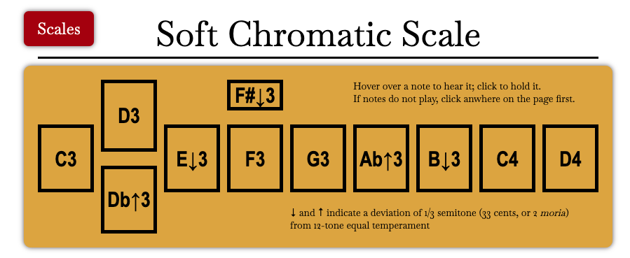

# Psaltic Art

Psaltic Art is a simple static site intended to help Western musicians understand the theory behind Byzantine Chant. Eventually there will be pages explaining the scales, the "tones", and the performance practice surrounding this ancient (and still living) musical tradition. Currently, the one available feature is a set of interactive scale players, which allow the user to hear what basic Byzantine tuning actually sounds like.

There are a number of tuning theories that attempt to model Byzantine tuning, but the most common divides the octave for practical purposes into 36 "1/6 steps". Most people, including trained musicians, have a difficult time imagining what that sounds like. As it turns out, these small variations in pitch are actually much easier to hear and reproduce than many Western musicians imagine. My hope is that these interactive scales will clear up this misunderstanding.